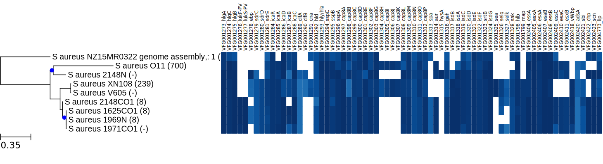
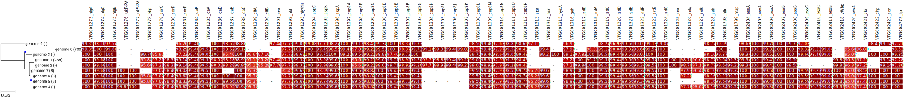
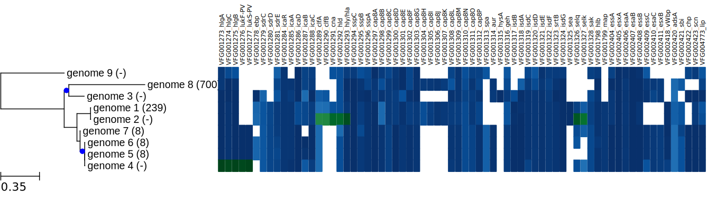

# description 

Build a whole genome phylogeny and diplay profiles of presence/absence of a set of sequences (based on tBLASTn results and defined identity cutoff). See examples below.
Used to investigate the conservation of virulence factors in *S. aureus* complete genomes.

If multiple BLAST hits are colocalised (overlap between the coordinates of two hits), only the hit with the highest identity is retained.
The phylogeny is build with *parsnp*. The figure made with the ete2 package.

# TODO

- change mapping procedure for mlst (extract fasta header and map file name to fasta header)
- change mapping procedure for parsnp (extract fasta header and map file name to fasta header)

# installation


```
conda install pyqt=4
conda install -c etetoolkit ete2
conda install -c bioconda mlst
conda install -c bioconda blast

```

# simple plot

- *-r* reference genome
- *-f* directory containing target fasta files. Fasta files should contain a single sequence. The fasta header should match the label file (parameter *-a*) or one LOCUS of one gbk file (parameter *-g*).
- *-b* fasta file to blast. Fasta entry headers are used as comlum labels (see example below).
- *-m* mlst sheme (see tseeman mlst)
- *-id* do not show identity values (only color scale)
- *-c* identity cutoff (aa)
- *-a* label mapping file (for the phylogeny)

- fasta file should contain a single sequence (multiple contigs should be concatenated into a single sequence)
- the label mapping file should have the following structure: fasta_header	label

```
CP007447	genome 1
CP013959	genome 2
CP016856	genome 3
CP016858	genome 4
CP016861	genome 5
CP016863	genome 6
CP017094	genome 7
CP024649	genome 8
LT699704	genome 9
```

```
blast2profile.py -r CP016861.fna -f fasta -b VF_saureus_edit.fa -m saureus -id -c 95 -a labels.tab

```

- the numbers in parenthesis are the ST type identified with *mlst*.


# use genbank to get labels for the phylogeny

- *-g* gbk file of the fasta files (used for the labels of the phylogeny). Fasta headers should match gbk LOCUS.

```
blast2profile.py -r CP016861.fna -f fasta -b VF_saureus_edit.fa -g gbk/*gbff -m saureus -id -c 95
```



# show identity values

```
blast2profile.py -r CP016861.fna -f fasta -b VF_saureus_edit.fa -g gbk/*gbff -m saureus -id -c 95
```




# highlight some cells with different colors

- specific cells can be highlighted if a filter is provided. The structure of the filter should be as follow: protein_name genome_accession. It sould match the header of the fasta files.


```
VFG001273_hlgA	CP016858
VFG001274_hlgC	CP016858
VFG001275_hlgB	CP016858
VFG001276_lukF-PV	CP016858
VFG001277_lukS-PV	CP016858
VFG001289_clfA	CP013959
VFG001290_clfB	CP013959
VFG001291_cna	CP013959
VFG001292_hld	CP013959
VFG001293_hly/hla	CP013959
VFG001313_spa	CP013959
VFG001326_selq	CP013959
VFG001327_selk	CP013959
```


```
blast2profile.py -r CP016861.fna -f fasta -b VF_saureus_edit.fa -m saureus -c 95 -a labels.tab -n -l -s -bf highlight.tab -id
```




